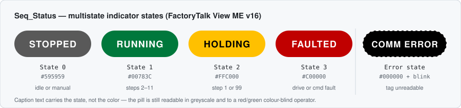

# Automation Portfolio

Controls and automation work by **Daniel Liddiard** — Studio 5000, TwinCAT 3, and the
OPC UA / MQTT / Ignition path between a PLC and the rest of a plant.

Every folder here is one machine problem, argued and solved. The rule is one machine story
across two platforms plus one IIoT path — not a junk drawer of class labs.

---

## Start here

**[projects/servo-cell-hmi-status](projects/servo-cell-hmi-status)** — the operator-facing
state of a five-axis Kinetix cell, derived once in the PLC instead of five times on the HMI.



One DINT, one routine, one indicator. The interesting part is not the ladder, it is the
three decisions in [docs/state-model.md](projects/servo-cell-hmi-status/docs/state-model.md):
why the shutdown ramp reports HOLDING and not STOPPED, why the four writes to one tag are a
priority encoder rather than a bug, and why there is deliberately no acknowledge latch.

That folder is also the format everything else here gets held to: a README that argues for
the design, source that imports and runs, a diagram, and a build sheet for anything that
lives in a binary a repo cannot carry.

---

## Projects

| Folder | Status | The problem it solves |
|---|---|---|
| [servo-cell-hmi-status](projects/servo-cell-hmi-status) | 🟢 **source in repo** | Operator state pill — one DINT in Logix, one multistate indicator in FTView ME |
| [l5x-from-spreadsheet](projects/l5x-from-spreadsheet) | 🟡 scoped | Engineering automation — generate Logix tags and routines from data instead of typing them |
| [intersection-controller](projects/intersection-controller) | 🟡 scoped | State machine with conflicting-call interlocks. Same thinking as a machine cell |
| [logix-fault-handler](projects/logix-fault-handler) | 🟡 scoped | First-out fault pattern — which alarm actually stopped the machine, not all forty |
| [twincat-packml-cell](projects/twincat-packml-cell) | ⚪ planned | The same cell in TwinCAT 3, PackML state model, simulation first |
| [iiot-edge-bridge](projects/iiot-edge-bridge) | ⚪ planned | That cell → OPC UA + MQTT → Ignition, one curated tag contract |

🟢 source committed and runnable · 🟡 scope and acceptance criteria written, source pending ·
⚪ sequenced behind an earlier folder on purpose

The order is deliberate. The IIoT bridge is last because a broker with no PLC behind it is a
screenshot, not a project.

Short technical notes — the LinkedIn-sized ones — live in [notes/](notes/).

---

## The through-line

The same cell, told three ways, is worth more than twelve unrelated labs:

```
   [ Logix cell ]                  [ TwinCAT cell ]
         |                                |
         |  same tag contract, same state model
         +---------------+----------------+
                         |
                     OPC UA
                         |
                    [ Ignition ]  screens · alarms · historian
                         |
                       MQTT      events only, never interlocks
```

Because both controllers publish the same contract, the Ignition screen does not change when
the PLC brand does. That is the whole argument for this path over a brand-only SCADA stack,
and it is written up in full in [docs/iiot-path.md](docs/iiot-path.md).

## What "done" means here

A folder is finished when it has all four:

1. A README that argues the design, not just a feature list
2. Source that imports and runs — sanitized, no plant names or IPs
3. One diagram
4. A 90-second clip of the machine **recovering from a fault**, not just running

Item 4 is the one that matters. Anyone can film a machine working.

## Repo conventions

- `python3 tools/validate.py` before pushing. It parses every committed L5X and resolves every
  relative link in every README. CI runs the same script on push — a bad export or a dead link
  fails there instead of in Studio 5000.
- Branch, commit, PR, merge. Even solo — the PR page is where the reasoning gets recorded.
- Vendor exports stay byte-identical to what the tool wrote them as. See [.gitattributes](.gitattributes).
- No employer, plant, or customer material. Sanitize names and IPs before the first commit,
  not after.
- Demo video is an unlisted YouTube or Drive link. Large binaries do not go in git.
- Full publishing checklist: [docs/publishing-rules.md](docs/publishing-rules.md)

## License

[MIT](LICENSE). Take the patterns.
